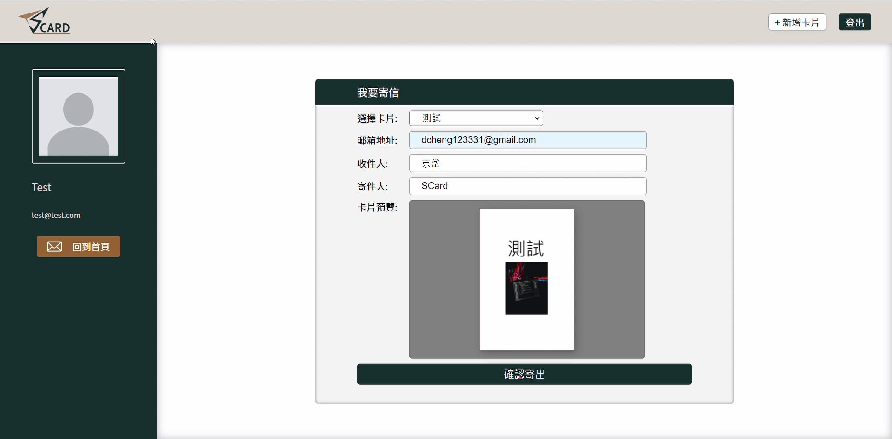

# [ Scard](https://scard-45610.web.app/)

This is a platform for users to customize card and send the meaningful card to meaningful people.

## Demo Link

Link: [https://scard-45610.web.app/](https://scard-45610.web.app/)
 
You can register a new accout to use the service or use the test account right down below.  
User: test@test.com  
Password: test123

## Technologies

- Front-End Basic
  - HTML / CSS /JavaScript
  - RWD
- Front-End Framework
  - React (Hook)
  - React Router
- Firebase
  - Storage
  - Firestore
  - Hoisting
  - Authentiication
  - Trigger Eamil
- Library
  - Fabric.js

## Flow Chart

## Features

- explore cards
  
- edit canvas (card pages)
  
- email card
  

## Future Features

- extend Authentication types
- leave commend on card
- search card and add card to favorites
- create folders for managing cards
- search history of sent cards
